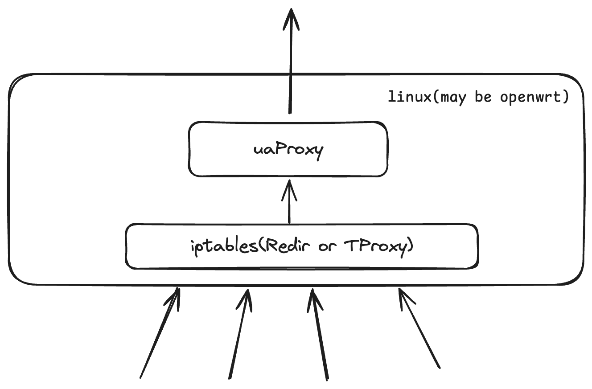

# uaProxy

利用clash, v2ray的方案(iptables-redir)实现对所有流量的监控,
找出http流量后, 修改其中的`User-Agent`字段, 从而实现对所有http流量的`User-Agent`修改.


## 代码思路
流量分为http和非http两种, 非http流量直接转发, http流量则可以通过看前几个字节判断是否是http流量.

如果是http流量, 则利用go官方的webServer的实现方法, 循环使用`http.ReadRequest()`读取http请求, 从中找到`User-Agent`字段, 修改后再写回.

## 使用方法
1. 网关设备开启 IP 转发。
在 `/etc/sysctl.conf` 文件添加一行 `net.ipv4.ip_forward=1` ，执行下列命令生效：`sysctl -p`

2. 为了实现所有TCP流量会经过uaProxy, iptables要这样设置
```sh
iptables -t nat -N uaProxy # 新建一个名为 uaProxy 的链
iptables -t nat -A uaProxy -d 192.168.0.0/16 -j RETURN # 直连 192.168.0.0/16
iptables -t nat -A uaProxy -p tcp -j RETURN -m mark --mark 0xff
# 直连 SO_MARK 为 0xff 的流量(0xff 是 16 进制数，数值上等同与上面配置的 255)，此规则目的是避免代理本机(网关)流量出现回环问题
iptables -t nat -A uaProxy -p tcp -j REDIRECT --to-ports 12345 # 其余流量转发到 12345 端口（即 uaProxy开启的redir-port）
iptables -t nat -A PREROUTING -p tcp -j uaProxy # 对局域网其他设备进行透明代理
iptables -t nat -A OUTPUT -p tcp -j uaProxy # 对本机进行透明代理
```

3. 运行uaProxy(建议uaProxy和config.yaml在一个文件夹下面)
```sh
./uaProxy &
```
> ‼️注意, 因为是利用了iptables的REDIRECT功能, 所以不能和clash, v2ray等软件同时使用, 会有冲突.

> 但这样做也更纯净, 性能最快, 我觉得应该是这个需求的最佳实现方案了.

------------------------------------------

[FAQ](FAQ.md)
